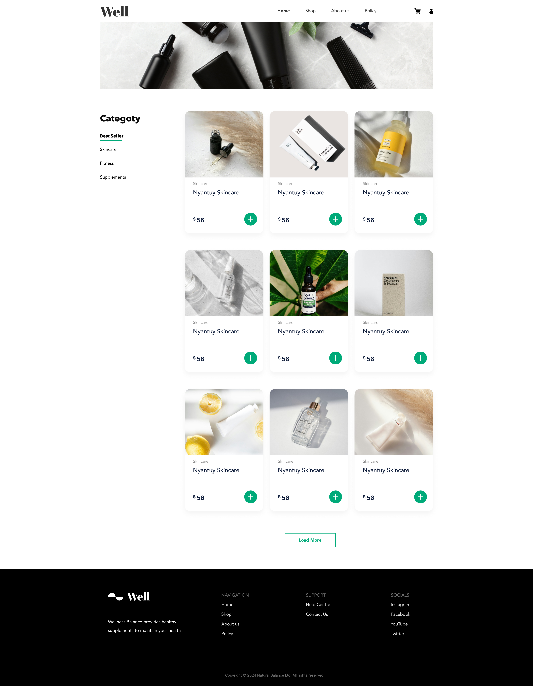
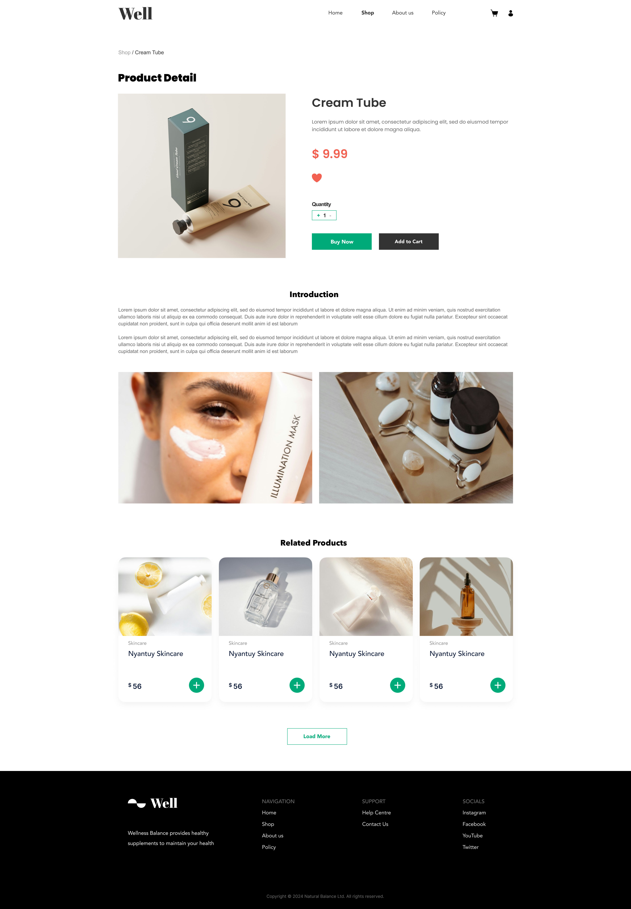
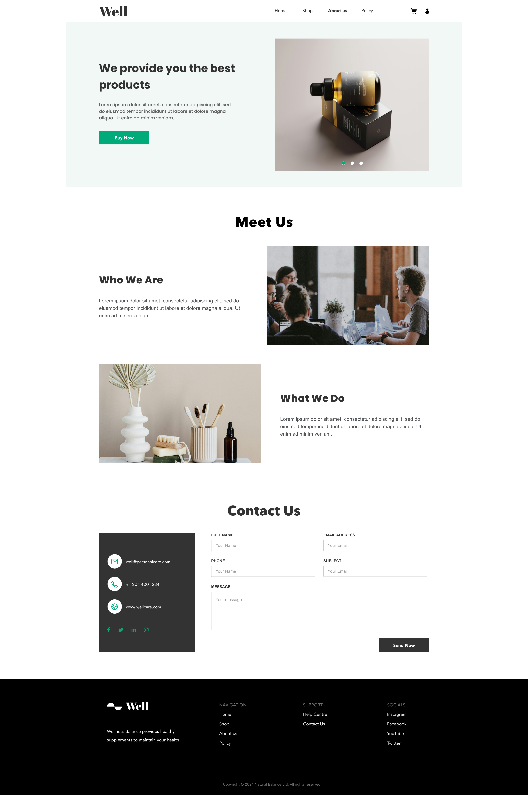
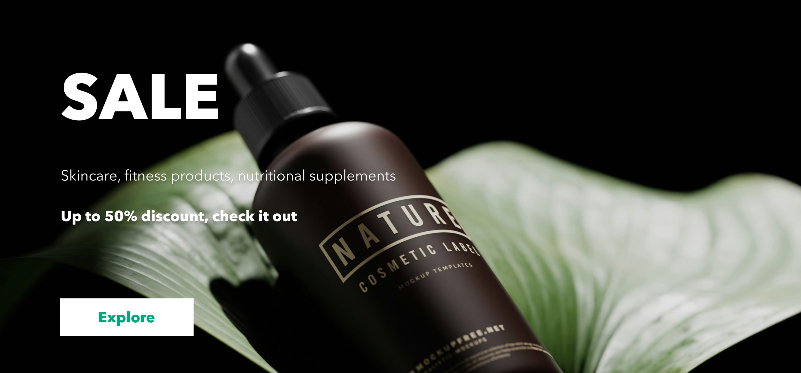
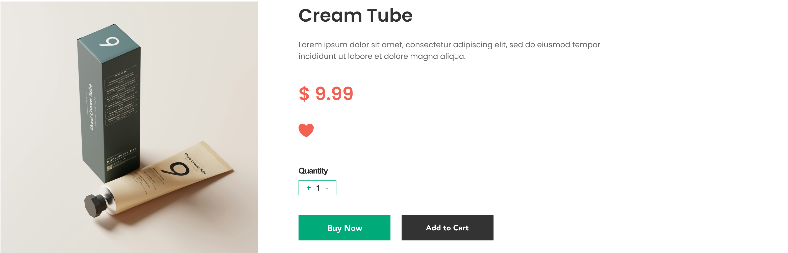
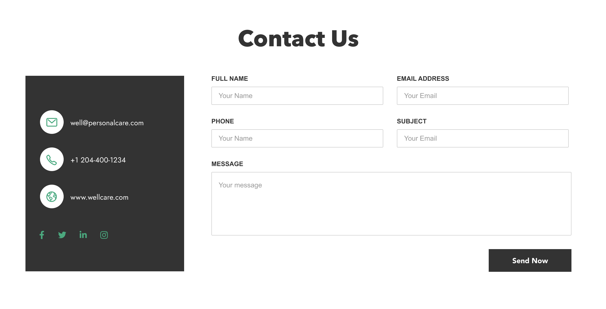

## 5. Proposed Design Solution

### Brand Color

We choose green(#00AB7A) as our brand color

#### Reasons

1.Green is commonly associated with nature, plants, and the environment. This connection makes it an ideal choice our brand as we want to emphasize natural, high-quality, and organic products

2.Green has a calming and soothing effect on the mind. It can reduce stress and promote relaxation. For our personal care brand, using green can help convey a sense of peace.

3.Green can evoke feelings of safety and trust.

### Design Mockups

Here are the design mockups for our project:

#### Landing Page

The landing page mockup presents the initial interface users will encounter. It features a clean, welcoming design with clear navigation and call-to-action buttons.

#### List View

The list view mockup displays how multiple items are shown in our shop page. Each item is presented with a thumbnail, title, and a brief description, allowing users to quickly scan through options.

#### Detailed View

The detailed view mockup provides an detailed look at a single item. It includes extensive information, images, and options related to purchasing service, enhancing user engagement and decision-making.

#### About Us

The About Us page mockup introduces our organization, highlights our values, and provides multiple methods to reach us. It is designed to build trust and connect with users.

### Design Components

#### Header

#### Footer

#### Home Banner

#### Category Section

#### Card Design for List View

#### Detail

#### Contact Us

