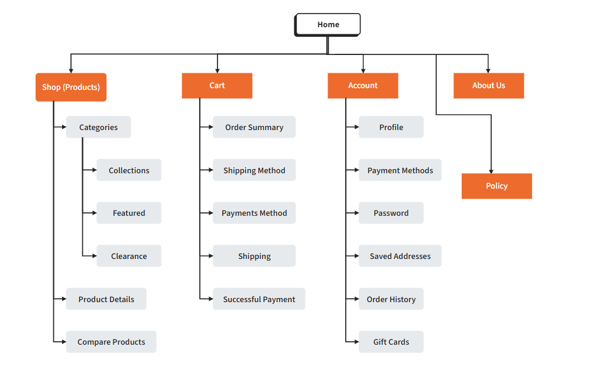
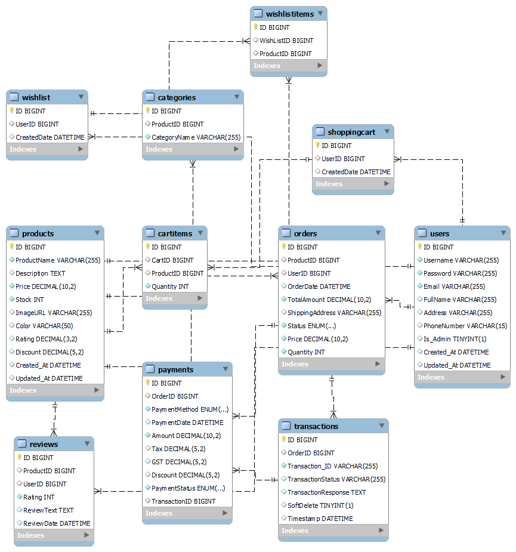
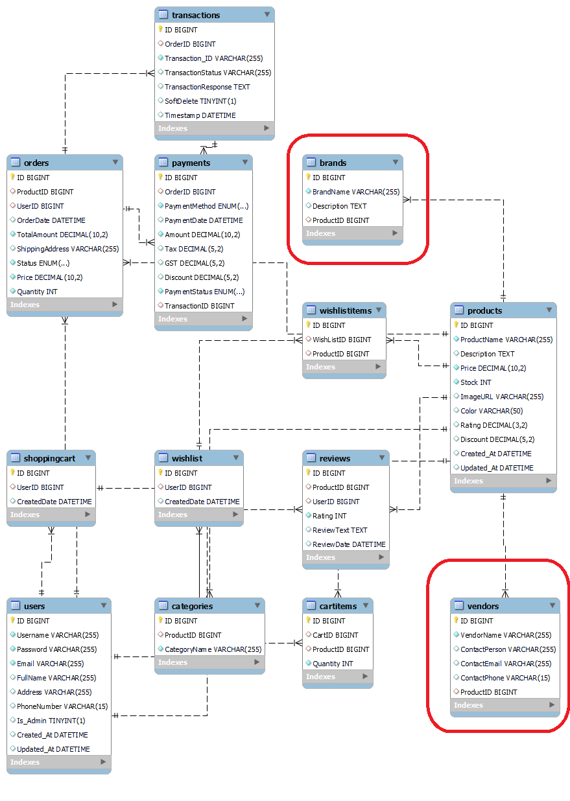

# Well - Health & Personal Care Web Application Development

- Created By: Team MYDASA
- Created For: Steve George
- Date: 31 July, 2024

[toc]

## 1. Project Overview
- WELL - Health & Personal Care is an e-commerce website that provides a wide range of health and personal care products. Our offerings include health supplements, personal care products, and organic supplements. The primary goal is to create a user-friendly, secure, and visually appealing platform where customers can easily find and purchase products that enhance their health and beauty.

## 2. Target Audience

- Our target audience includes male and female customers aged between 18 and 55 years. They are health-conscious individuals who prioritize wellness and beauty. This demographic is tech-savvy, values convenience, and seeks high-quality products. Our target audience includes both male and female customers aged between 18 and 55 years. They are health-conscious individuals who prioritize wellness and personal care. This demographic is tech-savvy, values convenience, and seeks high-quality products. Our target audience includes both male and female customers aged between 18 and 55 years. They are health-conscious individuals who prioritize wellness and beauty. This demographic is tech-savvy, values convenience, and seeks high-quality products.

## 3. Project Details

- **Project Name:** Well - Health & Personal Care
- **Project Duration:** 2 Weeks

### Scope of Work:  User / Guest (Frontend)

### Deliverables

1. Functional Web Application for all listed features
2. High-fidelity design mock-ups
3. UI/UX design specifications
4. Database schema and setup scripts
5. Frontend and backend code
6. Integration with payment gateway
7. Security requirements document and penetration testing report
8. Post-launch maintenance and support plan

### Admin Dashboard

### Product Management
- **Create**
  - Add new product
- **Read**
  - View list of all products
  - View product details
- **Update**
  - Edit existing product
- **Delete**
  - Remove product

### Category Management
- **Create**
  - Add new category
- **Read**
  - View list of all categories
- **Update**
  - Edit existing category
- **Delete**
  - Remove category

### User Management
- **Create**
  - Add new user
- **Read**
  - View list of all users
  - View user details
- **Update**
  - Edit existing user
- **Delete**
  - Remove user

### Order Management
- **Create**
  - (Typically, orders are created by users; however, the admin can manually create orders for customers if needed)
- **Read**
  - View list of all orders
  - View order details
- **Update**
  - Edit existing order
- **Delete**
  - Remove order

## 4. Technologies
### Frontend

- HTML
- JavaScript
- Bootstrap
- SCSS
- jQuery
- Node.js
- npm
- Vite

### Backend

- PHP
- Laravel
- Composer

### Database

- MySQL

### Server

- Ubuntu/Apache2
- Certbot

### Payment Gateway

- Stripe/Authorize.net (PCI DSS Compliance Gateway)

## 5. Proposed Design Solution

### Brand Color

We choose green(#00AB7A) as our brand color

#### Reasons

1.Green is commonly associated with nature, plants, and the environment. This connection makes it an ideal choice our brand as we want to emphasize natural, high-quality, and organic products

2.Green has a calming and soothing effect on the mind. It can reduce stress and promote relaxation. For our personal care brand, using green can help convey a sense of peace.

3.Green can evoke feelings of safety and trust.

### Design Mockups

Here are the design mockups for our project:

#### Landing Page

The landing page mockup presents the initial interface users will encounter. It features a clean, welcoming design with clear navigation and call-to-action buttons.

#### List View

The list view mockup displays how multiple items are shown in our shop page. Each item is presented with a thumbnail, title, and a brief description, allowing users to quickly scan through options.

#### Detailed View

The detailed view mockup provides an detailed look at a single item. It includes extensive information, images, and options related to purchasing service, enhancing user engagement and decision-making.

#### About Us

The About Us page mockup introduces our organization, highlights our values, and provides multiple methods to reach us. It is designed to build trust and connect with users.

### Design Components

#### Header

#### Footer

#### Home Banner

#### Category Section

#### Card Design for List View

#### Detail

#### Contact Us

## 6. User Personas/Use Case Statements

### 1. Jane Doe (28, Female)

**Role:** Guest User

#### Description
- **Demographics:** Unauthenticated users, potentially new visitors.
- **Needs:** Explore products, read reviews, and learn about the website's offerings.
- **Behaviour:** Browses products without making purchases, might consider signing up for an account.

#### Use Case Statement
- **As a Guest**, Jane wants to browse a variety of health and beauty products so that she can decide whether to sign up and make a purchase.

### 2. John Smith (35, Male)

**Role:** Authenticated User

#### Description
- **Demographics:** Registered users, both male and female, aged 18-55.
- **Needs:** Access personalized recommendations, track orders, and manage their account.
- **Behaviour:** Regularly logs in to purchase products, leaves reviews, and participates in the loyalty program.

#### Use Case Statement
- **As an Authenticated User**, John wants to view his order history so that he can track his past purchases and reorder products easily.

### 3. Erik Wilson

**Role:** Customer Service Representative (CSR)

#### Description
- **Demographics:** Employees of the company responsible for handling customer inquiries.
- **Needs:** Access to user accounts and order details to provide support.
- **Behaviour:** Logs in to assist customers with their queries, resolves issues related to orders, and processes returns.

#### Use Case Statement
- **As a CSR**, Erik wants to access customer order details so that he can assist customers with any issues they may have.

### 4. Joe Root

**Role:** Admin

#### Description
- **Demographics:** Site administrators responsible for managing the website.
- **Needs:** Full access to all site functionalities to manage products, users, and orders.
- **Behaviour:** Regularly updates product listings, manages user accounts, and monitors sales and website performance.

#### Use Case Statement
- **As an Admin**, Joe wants to add new products to the catalogue so that he can keep the website's offerings up to date.

## 7. Sitemap

### 7.1 FRONT END SITEMAP

### 7.2 Backend Panel

## 8. Server

### Ubuntu Server
- Ubuntu (a popular Linux distribution known for its stability and     user-friendliness)

### Apache2
- Apache2 is a widely used open-source web server that provides a robust, flexible,     and secure platform for hosting websites.

### Certbot
- Certbot is an open-source tool for automatically using Let's Encrypt certificates     on manually administrated websites to enable HTTPS.

## 9. Security on the Server

### Load Balancers
- **Function**: Distributes incoming network traffic across multiple servers to ensure no single server becomes overwhelmed.
- **Benefit**: Improves availability and reliability of the application by balancing the load. Very useful in protecting the server from DDoS attacks.

### Firewall
- **Function**: Monitors and controls incoming and outgoing network traffic based on predetermined security rules.
- **Benefit**: Protects the server from unauthorized access and potential threats by filtering traffic.

### Data Encryption
- **Function**: Encrypts data both at rest and in transit using algorithms like AES-256.
- **Benefit**: Ensures that sensitive data is protected from unauthorized access and breaches.

### Continuous Security Practices
- **Regular Updates**: Keeping the operating system and all software up to date to protect against vulnerabilities.
- **Access Control**: Use of SSH keys for authentication and disabling password-based logins.
- **Monitoring and Logging**: Implement continuous monitoring and logging to detect and respond to security incidents promptly.
- **Backup and Recovery**: Regularly back up data and have a recovery plan in place in case of data loss or corruption.
### 9.1 Security in the Web Application

#### Input Validation
- **Function:** Ensures that only properly formatted data is entered into the system.
- **Benefit:** Prevents common vulnerabilities like SQL injection and XSS by validating user input.

#### Output Sanitization
- **Function:** Cleans and encodes output data before sending it to the user's browser.
- **Benefit:** Protects against XSS attacks by ensuring malicious scripts are not executed in the browser.

#### Role-Based Access Control (RBAC)
- **Function:** Restricts access to resources based on the user's role within the application.
- **Benefit:** Ensures that users can only access the functionalities and data that are necessary for their role.

#### CSRF Tokens
- **Function:** Uses unique tokens for each session to prevent Cross-Site Request Forgery attacks.
- **Benefit:** Ensures that unauthorized commands are not executed on behalf of authenticated users.

#### Session Management
- **Function:** Manages user sessions securely with mechanisms like session expiration and regeneration.
- **Benefit:** Prevents session hijacking and fixation by properly managing user sessions.

#### SSL (Secure Sockets Layer)
- **Function:** Encrypts data transmitted between the client and the server.
- **Benefit:** Protects data in transit from being intercepted or tampered with by attackers.

#### Defensive Coding Practices
- **Authentication:** Implementation of strong authentication mechanisms, such as multi-factor authentication (MFA).
- **Error Handling:** Preventing exposing detailed error messages to users, as they can provide valuable information to attackers.
- **Security Headers:** Using HTTP security headers like Content Security Policy (CSP), X-Content-Type-Options, and X-Frame-Options to protect against various attacks.
- **Regular Security Audits:** Conduct regular security audits and vulnerability assessments to identify and address potential security issues.

## 10. Database

### Entities and Relationships

#### 1. Users
- **Attributes**: ID, Username, Password, Email, FullName, Address, PhoneNumber, Is_Admin, Created_At, Updated_At
- **Purpose**: Manages user information, including both customers and administrators.

#### 2. Products
- **Attributes**: ID, ProductName, Description, Price, Stock, ImageURL, Color, Rating, Discount, Created_At, Updated_At
- **Purpose**: Stores detailed information about the products available for sale.

#### 3. Categories
- **Attributes**: ID, CategoryName, Description
- **Purpose**: Organize products into various categories for easy navigation.

#### 4. Orders
- **Attributes**: ID, UserID, OrderDate, TotalAmount, ShippingAddress, Status, Quantity, Price
- **Purpose**: Tracks order details and status for each purchase.

#### 5. Payments
- **Attributes**: ID, OrderID, PaymentMethod, PaymentDate, Amount, Tax, GST, Discount, PaymentStatus, TransactionID
- **Purpose**: Records payment details for orders.

#### 6. Transactions
- **Attributes**: ID, OrderID, Transaction_ID, TransactionStatus, TransactionResponse, SoftDelete, Timestamp
- **Purpose**: Tracks transaction details associated with payments.

#### 7. Reviews
- **Attributes**: ID, ProductID, UserID, Rating, ReviewText, ReviewDate
- **Purpose**: Stores customer reviews and ratings for products.

#### 8. ShoppingCart
- **Attributes**: ID, UserID, CreatedDate
- **Purpose**: Temporarily holds items that users intend to purchase.

#### 9. CartItems
- **Attributes**: ID, CartID, ProductID, Quantity
- **Purpose**: Manages individual items within a shopping cart.

#### 10. Wishlist
- **Attributes**: ID, UserID, CreatedDate
- **Purpose**: Allows users to save products for future reference.

#### 11. WishlistItems
- **Attributes**: ID, WishlistID, ProductID
- **Purpose**: Manages individual items within a wishlist.

### Key Relationships
- **Users to Orders**: A user can place multiple orders.
- **Orders to Payments**: Each order can have multiple payment records.
- **Orders to Transactions**: Each order can have multiple transactions.
- **Products to Reviews**: Each product can have multiple reviews.
- **Products to Categories**: Each product can belong to one category, but a category can have multiple products.
- **ShoppingCart to CartItems**: Each shopping cart can have multiple items.
- **Wishlist to WishlistItems**: Each wishlist can have multiple items.

## 11. Value Adds

### BRANDS and VENDORS

To enhance the "WELL" Health & Beauty e-commerce platform, we have added two key features:

### BRANDS Table

- **Attributes**: ID, BrandName, Description, ProductID
    - **Benefit**: Allows products to be categorized by brand, enabling brand-specific promotions and improved customer experience.

### VENDORS Table

- **Attributes**: ID, VendorName, ContactPerson, ContactEmail, ContactPhone, ProductID
    - **Benefit**: Supports multiple vendors, facilitating marketplace expansion with diverse product offerings and competitive pricing.

### Marketplace Expansion

These features prepare "WELL" for future growth in a marketplace. By supporting multiple brands and vendors, the platform can offer a wider variety of products, attract more customers, and create new revenue streams through vendor partnerships. This strategic addition positions "WELL" for scalability and long-term success in the competitive e-commerce landscape.

## 12. Revised ERD for Value Adds

### Changes to the ERD

1. **Addition of BRANDS Table**: Each product can be associated with one brand, and a brand can have multiple products. This introduces a one-to-many relationship between the BRANDS table and the PRODUCTS table.
2. **Addition of VENDORS Table**: Each product can be associated with one vendor, and a vendor can supply multiple products. This creates a one-to-many relationship between the VENDORS table and the PRODUCTS table.

These changes will enable the "WELL" platform to support brand categorization and vendor management, enhancing the system's capability to expand into a marketplace. The revised ERD will incorporate these additional tables and relationships to facilitate the new value-added features.

## 13. Our Team
### Manish Kumar
**Role:** Project Manager

### Yongdong Xiang
**Role:** Lead Backend Developer, Git Manager

### Dongqing Ye
**Role:** Lead UI/UX Designer, Front End Developer

### Aman Dawar
**Role:** Front End Developer, Database Engineer

### Shivangi Koradiya
**Role:** Lead Database Engineer, Backend Developer
